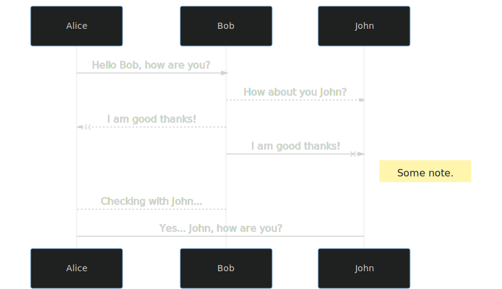

# scully-plugin-mermaid - The mermaid  `postRenderer`

[](https://www.npmjs.com/package/scully-plugin-mermaid)
[](https://david-dm.org/d-koppenhagen/scully-plugin-mermaid)
[](https://david-dm.org/d-koppenhagen/scully-plugin-mermaid?type=dev)

[](https://www.npmjs.com/package/scully-plugin-mermaid)
[](http://makeapullrequest.com)
[](https://github.com/ellerbrock/open-source-badge/)

[](https://conventionalcommits.org)
[](http://commitizen.github.io/cz-cli/)
[](https://github.com/semantic-release/semantic-release)

## Installation

To install this library with `npm` run:

```bash
npm i scully-plugin-mermaid --save-dev
```

## Usage

Apply the *postRenderer* plugin via your Scully config file (`scully.<project-name>.config.ts`):

```ts
/*
* The options for mermaid will be passed 1:1
*/
import { getMermaidPlugin, MermaidPluginName, MermaidPluginConfig } from 'scully-plugin-mermaid';

const mermaidOptions: MermaidPluginConfig = {
  /**
   * '.language-mermaid' is also the default, so no need to define this
   */
  selector: '.language-mermaid',
  /**
   * configuration for the mermaid plugin
   * All params as defined here are valid:
   * https://mermaid-js.github.io/mermaid/getting-started/Setup.html#mermaidapi-configuration-defaults
   */
  config: {
    theme: 'dark',
  }
};
const MermaidPlugin = getMermaidPlugin();
setPluginConfig(MermaidPlugin, mermaidOptions);

export const config: ScullyConfig = {
  projectRoot: './src',
  projectName: 'scully-mermaid',
  outDir: './dist/static',
  routes: {
    '/blog/:slug': {
      type: 'contentFolder',
      postRenderers: [MermaidPluginName], // apply the postRenderer
      slug: {
        folder: './blog',
      },
    },
  },
};
```

By default, you don't need to add any options. The defaults from Mermaid will be used [as described in the official docs](https://mermaid-js.github.io/mermaid/getting-started/Setup.html#mermaidapi-configuration-defaults).
You can use any of the described mermaid config parameter.

## Example

After running the *postRenderer* it will convert markdown content like the following into SVG graphics:

<pre class="language-text"><code class="language-text">```mermaid
sequenceDiagram
    Alice ->> Bob: Hello Bob, how are you?
    Bob-->>John: How about you John?
    Bob--x Alice: I am good thanks!
    Bob-x John: I am good thanks!
    Note right of John: Some note.

    Bob-->Alice: Checking with John...
    Alice->John: Yes... John, how are you?
```</code></pre>

The above example will result in a graphic like this one:



The resulting SVG is wrapped into an HTML `<div>` element with the class `mermaid-svg` that allows you easily to adjust some further styles.